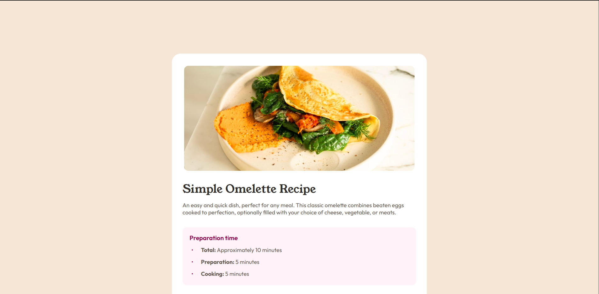

# Frontend Mentor - recipe-page-main

This challenge will help you focus on writing semantic HTML. Ensure you think through what HTML elements are most appropriate for each piece of content.

## Table of contents

- [Overview](#overview)
  - [Screenshot](#screenshot)
  - [Links](#links)
- [My process](#my-process)
  - [Built with](#built-with)
- [Author](#author)

## Overview

### Screenshot

 
### Links

- Solution URL: [Repo](https://github.com/sakthivel155/recipe-page-main)
- Live Site URL: [Live Demo](https://sakthivel155.github.io/recipe-page-main/)

## My process

### Built with

- Semantic HTML5 markup
- CSS custom properties
- Flexbox
- Mobile-first workflow
- Table

## Author

- Author - Sakthivel Ramesh
- Frontend Mentor - [@sakthivel155](https://www.frontendmentor.io/profile/sakthivel155)
- Twitter - [@SakthivelRame10](https://x.com/SakthivelRame10)

